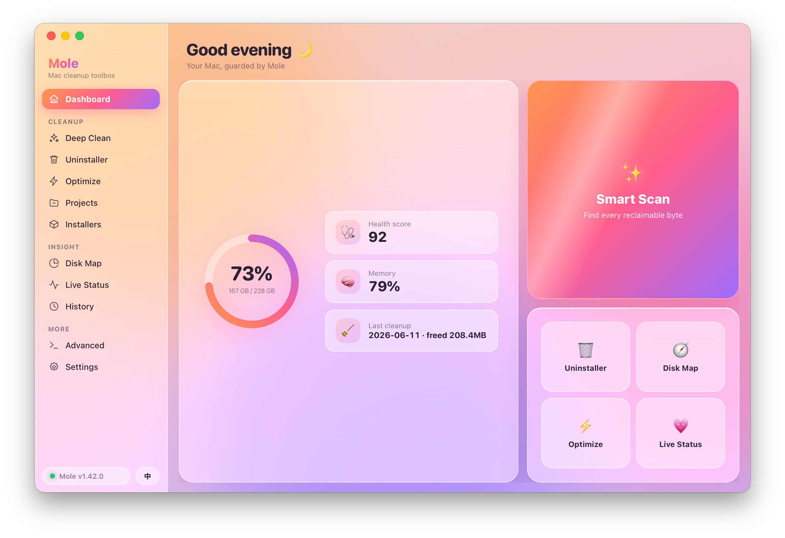

<p align="center">
  
</p>

<p align="center">
  <a href="LICENSE"></a>
  
  
  
</p>

<p align="center">
  <b>English</b> · <a href="#中文">中文</a>
</p>

---

**MoleUI** is a native macOS GUI for [tw93/Mole](https://github.com/tw93/Mole) (55,000+ ⭐ on GitHub). Mole itself is a powerful command-line Mac cleanup tool — it clears junk files, frees up storage, uninstalls apps, and optimizes your system. MoleUI wraps it in a polished, easy-to-use "liquid glass" shell, turning a CLI-first tool into an out-of-the-box Mac app that anyone can use.

> ❤️ **A tribute to the original author [@tw93](https://github.com/tw93):** MoleUI is only a graphical shell — all the real cleanup power comes from Mole. If it helps you, please go [give the original project a star](https://github.com/tw93/Mole).

<p align="center">
  
</p>

## ✨ Features

- **🖥 Universal — Intel & Apple Silicon** — one installer runs natively on both chip families.
- **🦀 Tiny, written in Rust** — built on Tauri with the system's own WebView; the installer is under 13 MB.
- **🔒 Privacy-first** — no data ever leaves your Mac, no background daemons; all cleanup happens locally, and the network is touched only when you explicitly "Check for updates".
- **🧹 The complete Mole feature set** — deep clean (caches / logs / browser data / orphaned files), app uninstall (leftovers included, sent to the Trash by default so it stays recoverable), system optimization, project-artifact purge (`node_modules`, `target`, …), installer cleanup, visual disk analysis, live system status, and cleanup history.
- **🎯 Scan → tick → clean** — entering a module scans automatically; results are grouped by category with sizes and individual checkboxes, and any directory you uncheck is added to the whitelist. System-level cleanup goes through the **native macOS authorization dialog** (Touch ID supported) — you never type a password into a terminal.
- **🌗 Bilingual + automatic light/dark** — follows the system appearance; switch languages with one click in the sidebar.
- **📦 Officially signed & notarized** — Developer ID signed and notarized by Apple, so it runs straight after download with no "unidentified developer" prompt.
- **⌨️ Advanced mode** — the full interactive `mole` terminal is kept for power users.

## 📥 Install

1. Download the latest `MoleUI_x.y.z_universal.dmg` from [Releases](../../releases).
2. Open the DMG and drag **MoleUI** into Applications.
3. Launch it — **the Mole CLI is already bundled inside the app, nothing else to install.**

> MoleUI ships with Mole built in and works out of the box. If you already have `mole` installed on your system (e.g. via Homebrew), MoleUI will prefer that copy.

## 🔨 Build from source

Requires [Rust](https://rustup.rs), [Node.js](https://nodejs.org), and the Xcode Command Line Tools.

```bash
git clone https://github.com/Zhili1004/MoleUI.git
cd MoleUI
npm install
npx tauri build                                    # current architecture
npx tauri build --target universal-apple-darwin    # universal (Intel + Apple Silicon)
```

See [`scripts/`](scripts) for the signing / notarization helpers.

## 🧩 How it works

MoleUI is a [Tauri 2](https://tauri.app) app: a Rust backend with a system-WebView front-end (plain HTML/CSS/JS, no front-end framework). It drives the bundled `mole` CLI as a subprocess — `--dry-run` produces a structured cleanup list that becomes a checkable UI, the JSON output of `status` / `analyze` powers the dashboard and disk map, and system-level operations raise the native macOS authorization dialog via `SUDO_ASKPASS`. The Mole CLI itself is bundled in full under `src-tauri/resources/mole-dist/`.

## 🙏 Credits & License

MoleUI stands on the shoulders of [**tw93/Mole**](https://github.com/tw93/Mole). Heartfelt thanks to [@tw93](https://github.com/tw93) and every Mole contributor for creating such an excellent open-source tool.

- **MoleUI** (this project's own code) is open-sourced under **GPL-3.0**, in line with upstream Mole.
- This repository **bundles the Mole CLI** (under [`src-tauri/resources/mole-dist/`](src-tauri/resources/mole-dist)); its source comes from the Mole repository's `main` branch at commit [`634433d`](https://github.com/tw93/Mole/commit/634433d921e2), likewise licensed **GPL-3.0**, with the original `LICENSE` and `TRADEMARK.md` preserved intact. The corresponding source is that upstream commit.
- Use of the "Mole" name and marks follows the upstream [trademark policy](https://github.com/tw93/Mole/blob/main/TRADEMARK.md). MoleUI is an independent community project, **not affiliated with or endorsed by** the original author.

See [LICENSE](LICENSE) for the full license and [NOTICE](NOTICE) for third-party details.

---

<a name="中文"></a>

## 中文

**MoleUI** 是为热门开源项目 [tw93/Mole](https://github.com/tw93/Mole)（GitHub 55,000+ Stars 🌟）打造的原生 macOS 图形界面。Mole 本身是一个强大的命令行 Mac 清理工具——清理垃圾文件、释放存储空间、卸载应用、优化系统状态；MoleUI 给它套上一层好看好用的「液态玻璃」外壳，让原本偏命令行的工具变成**开箱即用、人人会用**的 Mac App。

> ❤️ **致敬原作者 [@tw93](https://github.com/tw93)**：MoleUI 只是一层图形外壳，所有真正的清理能力都来自 Mole。如果它帮到了你，请去给 [原项目点一颗 Star](https://github.com/tw93/Mole)。

### ✨ 特点

- **🖥 Intel / Apple Silicon 通用** —— 一个安装包同时支持两种芯片的 Mac
- **🦀 Rust 编写，极致轻量** —— 基于 Tauri，使用系统自带 WebView，安装包 < 13 MB
- **🔒 隐私优先** —— 不上传任何数据、无后台常驻进程，所有清理都在本机完成，只有你主动「检查更新」时才访问网络
- **🧹 覆盖 Mole 全部能力** —— 深度清理（缓存 / 日志 / 浏览器数据 / 孤儿文件）、应用卸载（连带残留，默认进废纸篓可恢复）、系统优化、项目产物清理（`node_modules`、`target` 等）、安装包清理、磁盘可视化分析、实时系统状态、清理历史
- **🎯 扫描 → 勾选 → 清理** —— 进入模块自动扫描，结果按分类带大小展示并可逐项勾选，取消勾选的目录自动加入白名单；系统级清理通过 macOS **原生授权弹窗**（支持 Touch ID），绝不在终端里手敲密码
- **🌗 中英双语 + 自动深浅色** —— 跟随系统，侧边栏一键切换语言
- **📦 已官方签名并公证** —— Developer ID 签名 + Apple 公证，下载即用，无「身份不明的开发者」拦截
- **⌨️ 高级模式** —— 为高级玩家保留完整的 `mole` 交互式终端

### 📥 安装

1. 到 [Releases](../../releases) 下载最新的 `MoleUI_x.y.z_universal.dmg`
2. 打开 DMG，把 **MoleUI** 拖进「应用程序」
3. 启动即可——**Mole 命令行已内置在 App 内，无需另外安装任何东西**

> MoleUI 内置了 Mole，开箱即用。如果你的系统里已经用 Homebrew 等方式装过 `mole`，MoleUI 会优先使用系统里的那一份。

### 🔨 从源码构建

需要 [Rust](https://rustup.rs)、[Node.js](https://nodejs.org)、Xcode Command Line Tools。

```bash
git clone https://github.com/Zhili1004/MoleUI.git
cd MoleUI
npm install
npx tauri build                                    # 当前架构
npx tauri build --target universal-apple-darwin    # Intel + Apple Silicon 通用包
```

签名 / 公证脚本见 [`scripts/`](scripts)。

### 🧩 它是怎么工作的

MoleUI 是一个 [Tauri 2](https://tauri.app) 应用：Rust 后端 + 系统 WebView 前端（原生 HTML/CSS/JS，无前端框架）。它把内置的 `mole` 命令行当作子进程调用——用 `--dry-run` 拿到结构化的清理清单渲染成可勾选列表，用 `status` / `analyze` 的 JSON 输出驱动仪表盘和磁盘分析，系统级操作经 `SUDO_ASKPASS` 触发 macOS 原生授权框。Mole 命令行本体完整打包在 `src-tauri/resources/mole-dist/` 内。

### 🙏 致谢与许可

MoleUI 站在 [**tw93/Mole**](https://github.com/tw93/Mole) 的肩膀上，衷心感谢 [@tw93](https://github.com/tw93) 及 Mole 的所有贡献者创造了如此出色的开源工具。

- **MoleUI**（本项目自身代码）以 **GPL-3.0** 协议开源，与上游 Mole 保持一致。
- 本仓库**打包了 Mole 命令行**（位于 [`src-tauri/resources/mole-dist/`](src-tauri/resources/mole-dist)），其源码来自 Mole 仓库 `main` 分支 commit [`634433d`](https://github.com/tw93/Mole/commit/634433d921e2)，同样以 **GPL-3.0** 授权，原始 `LICENSE` 与 `TRADEMARK.md` 均一并保留。对应源码即上游仓库该 commit。
- 「Mole」相关名称 / 标识的使用请遵循上游的 [商标政策](https://github.com/tw93/Mole/blob/main/TRADEMARK.md)。MoleUI 是一个独立的社区项目，**与原作者无隶属关系**，也未获其背书。

完整协议见 [LICENSE](LICENSE)，第三方说明见 [NOTICE](NOTICE)。
